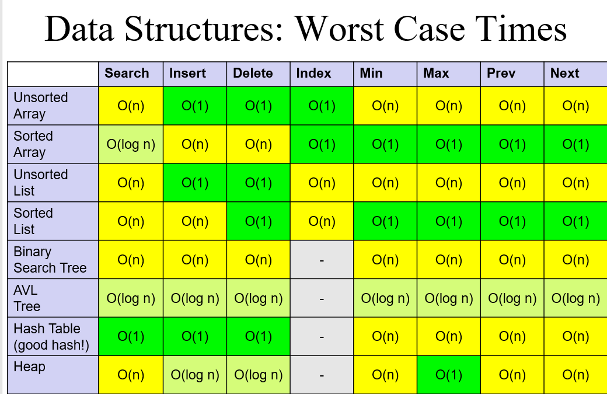

# Information for CSE 830

**CSE 830: Design and Theory of Algorithms**

Below are the documents and links needed for Spring 2022.

**[Syllabus](syllabus.html)** - provides basic information about the course including how you will be graded.

**[Piazza](https://piazza.com/class/ky8ltkngb2bf2)** a place for asynchronous discussions and Q&A sessions.

**Zoom** will be used for all class sessions.  The Zoom link has been e-mailed to all students and can be found on Piazza.

Below are the week-by-week topics that will be covered.

# Due dates

- Every friday: weekly lecture review
- Homework: 1/25, 2/8, 2/22, 3/15, 3/29, 4/12, 4/26
- Take-home final: 5/6

# Current course content



  {% assign this_week = "now" | date: "%W" | minus: 1 %}
  {% assign last_week = "now" | date: "%W" | minus: 2 %}
  {% assign next_week = "now" | date: "%W" | plus: 0 %}

  {% assign postWeek = post.date | date: "%W" | minus: 0 %}

  
   <h2>Last week: <a href="{{ site.url }}{{ site.baseurl }}{{ post.url }}">{{ post.title }}</a></h2>
  

  
   <h2>This week: <a href="{{ site.url }}{{ site.baseurl }}{{ post.url }}">{{ post.title }}</a></h2>
  

 
   <h2>Next week: <a href="{{ site.url }}{{ site.baseurl }}{{ post.url }}">{{ post.title }}</a></h2>
  



# Reference material

## Data structure runtimes table

